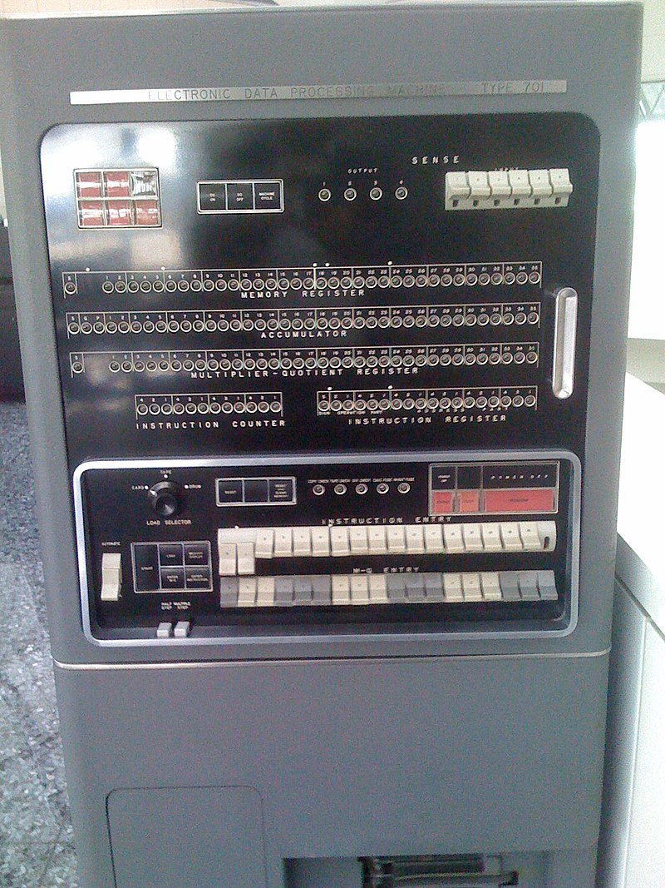
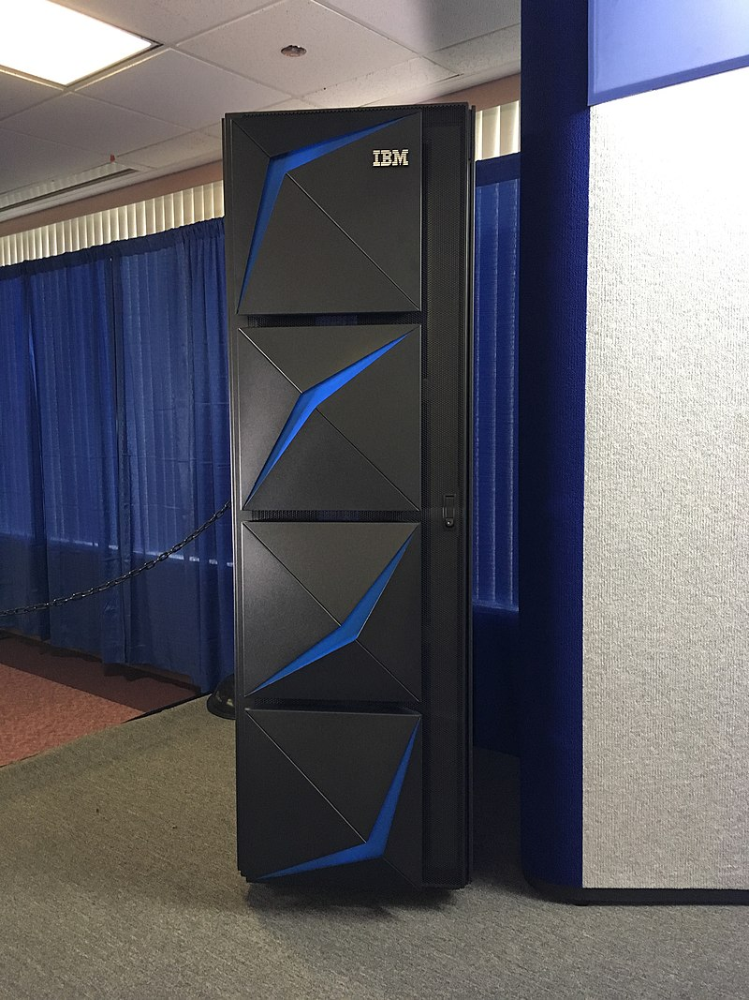
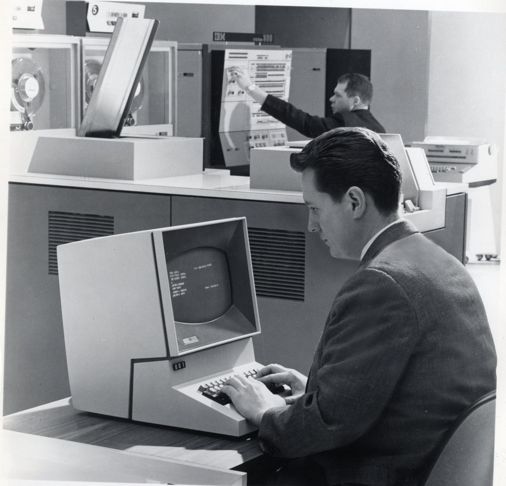
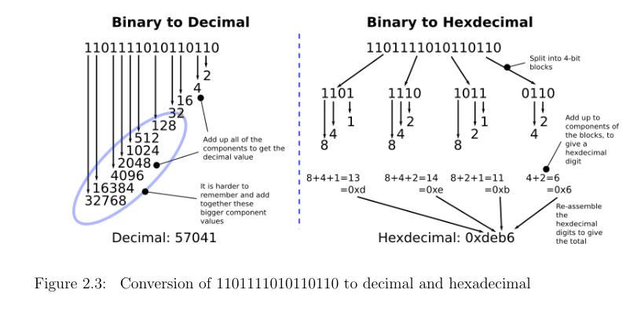

# Table of contents

- [GUI vs CLI](#gui-vs-cli)
- [Interpreter vs compiler](#interpreter-vs-compiler)
- [What is a program](#what-is-a-program)
- [Assembly and ISA](#assembly-and-isa)
- [Hex opcodes](#hex-opcodes)
- [Operating system](#operating-system)
- [Libraries](#libraries)
- [Decline in programming](#decline-in-programming)

# GUI vs CLI  

# Interpreter vs compiler

Practice!

# What is a program

Is it a text like programming language or a set of bytes?

# Assembly and ISA

- [x86 instruction listing](https://en.wikipedia.org/wiki/X86_instruction_listings)
- [x86 syscalls](https://x86.syscall.sh/)
- [./prep/hola.asm](./prep/hola.asm)
- Don't forget about `xxd`!

# Hex opcodes

*Screenshot from the book Writing a Simple Operation System from Scratch by Nick Blundell*

# Operating system

[./prep/os.c](./prep/os.c)

# Libraries

It's just a reusable program files

# Decline in programming

1. Tainted idea of Linux
2. Isn't Docker a good idea?
3. Web is terrible. [Leftpad incident](https://qz.com/646467/how-one-programmer-broke-the-internet-by-deleting-a-tiny-piece-of-code)
4. Business does not give a shit about security. [Yandex's penalty](https://www.interfax.ru/russia/878055)
5. [Overthinking problem](https://github.com/kradalby/resume)
